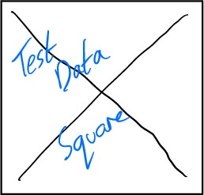
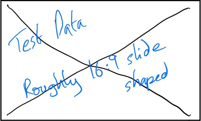
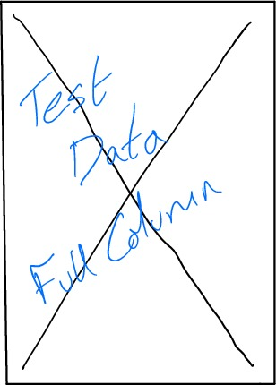
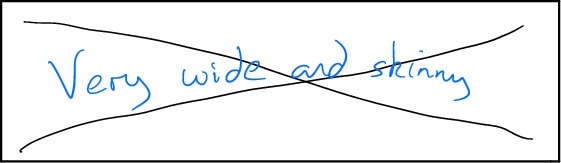

============================================
Example presentation for slideskokaren
============================================

Full Slide Image Aspect Square
--------------------------------------------

Full Slide Image Aspect Matching
--------------------------------------------

Full Slide Image Aspect Skinny
--------------------------------------------

Full Slide Image Aspect Fat
--------------------------------------------

Full Text Slide
--------------------------------------------

* A bullet.
* *Another* bullet **stronger** emphasis.

1. Numbered thing
2. Again

* Links look like `slashdot <http://slashdot.org/>`_ inlined.
* Inlined :code:`interpreted text < perfect`  and :shell:`inline literals`.

Splitting Vertically #Cols
--------------------------------------------

Some simple paragraph text, unformatted in any particular way.

.. topic:: A callout test

  This being the body contained within.

Some other text for padding.

Padding more on the slide.

Splitting Horizontally #Rows
--------------------------------------------

Need some rough paragraph shaped text type stuff in here
to check how the filling works on the slide.

Other styles
------------

::

  This is a standard inline block
    that preserves whitespace and indent.

.. code::

  int main()
  {
    printf("yo\n");
  }

.. epigraph::

  This would be a quote then.

  -- A. Dude

Table tests
--------------------------------------------
+------------+------------+-----------+ 
| Header 1   | Header 2   | Header 3  | 
+============+============+===========+ 
| body row 1 | column 2   | column 3  | 
+------------+------------+-----------+ 
| body row 2 | Cells may span columns.| 
+------------+------------+-----------+ 
| body row 3 | Cells may  | - Cells   | 
+------------+ span rows. | - contain | 
| body row 4 |            | - blocks. | 
+------------+------------+-----------+

+------+-------+-------+
|Table |Testing|Demo   |
+======+=======+=======+
|  Simple span |inside |
+------+-------+-------+
|x     |y      |z      |
+------+-------+-------+
|123   |4.56   |-77.123|
+------+-------+-------+

